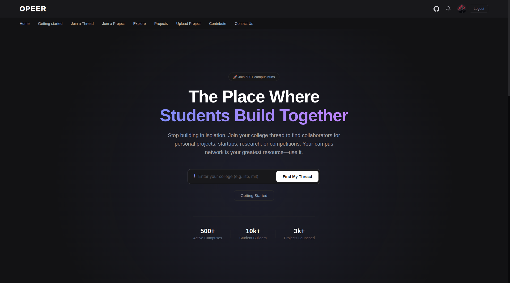
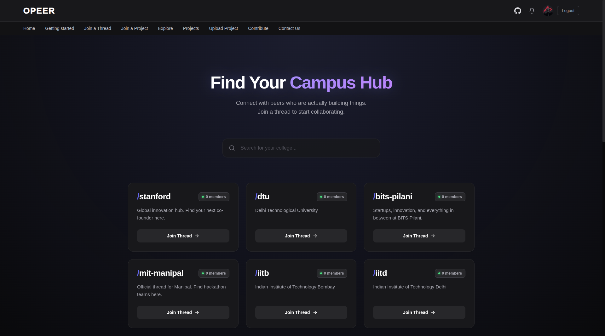

# OPEER 🚀

> **Connect, Collaborate, and Build with Peers across Campuses.**

## 🌟 Introduction

In the fragmented world of university networking, finding the right people for your projects, hackathons, or startups can be a challenge. **OPEER** bridges this gap by creating a unified platform where students from different universities can connect, collaborate, and grow together.

Whether you're a developer looking for a designer, a founder looking for a co-founder, or just want to see what's building at other campuses, OPEER is your gateway to the student builder ecosystem.


*(Note: Please ensure `dashboard.png` is in the `assets` folder)*

---

## ✨ Key Features

### � **Campus Hubs**
Connect with your local ecosystem. Join dedicated threads for your university (e.g., `/iitb`, `/stanford`, `/mit`) to find peers, events, and discussions specific to your campus.

### 🤝 **Smart Project Recruiting**
Stop spamming WhatsApp groups. Create detailed project listings specifying the exact skills you need (e.g., "React Developer", "UI/UX Designer").
- **Skill-based Filtering**: Applicants can filter projects by tech stack.
- **Role Specifications**: Define the exact role and year of study required.

### 🛤️ **Integrated Project Dashboard**
Once a team is formed, OPEER provides the tools to manage it:
- **Kanban Board**: A built-in drag-and-drop task board to track progress (Todo, In Progress, Done).
- **Project Resources**: Centralized space for links, docs, and assets.
- **Private Team Chat**: Real-time communication for your project members.

### 👤 **Developer-First Profiles**
Your OPEER profile is your resume.
- **Portfolio Showcase**: Link your best projects.
- **GitHub Integration**: Automatically display your GitHub stats and repositories.
- **Skill Tags**: Highlight your expertise.

### 🌐 **Explore & Discover**
- **Global Feed**: See what's trending across all campuses.
- **Showcase**: Highlight your finished projects to the entire community.

---

## 📸 visual Tour

| **Campus Discovery** | **Joined Hubs** |
|:---:|:---:|
|  |  |
| *Find threads for your college* | *Quick access to your communities* |

---

## 🛠️ Tech Stack

OPEER is built with a modern, scalable stack designed for performance and developer experience.

### **Frontend**
- **Framework**: [React 19](https://react.dev/) with [Vite](https://vitejs.dev/)
- **Styling**: CSS Modules & Custom Design System (Dark Mode First)
- **Icons**: [Lucide React](https://lucide.dev/)
- **State Management**: React Context & Hooks

### **Backend**
- **Runtime**: [Node.js](https://nodejs.org/) & [Express](https://expressjs.com/)
- **Database**: [PostgreSQL](https://www.postgresql.org/)
- **ORM**: [Prisma](https://www.prisma.io/)
- **Authentication**: [Passport.js](https://www.passportjs.org/) (GitHub & Google OAuth)

---

## 🚀 Getting Started

Follow these steps to set up the project locally.

### Prerequisites
- Node.js (v18 or higher)
- PostgreSQL installed and running
- npm or yarn

### Installation

1. **Clone the repository**
   ```bash
   git clone https://github.com/ShrijalDubey/OPEER.git
   cd OPEER
   ```

2. **Backend Setup**
   ```bash
   cd backend
   npm install
   
   # Create .env file
   cp .env.example .env
   # Update .env with your database credentials and OAuth keys
   
   # Run Database Migrations
   npx prisma migrate dev --name init
   
   # Start the server
   npm run dev
   ```

3. **Frontend Setup**
   ```bash
   # Open a new terminal
   cd frontend
   npm install
   npm run dev
   ```

4. **Visit the App**
   Open [http://localhost:5173](http://localhost:5173) in your browser.

---

## 🤝 Contributing

We believe in the power of open source. If you'd like to contribute:
1. Fork the repo.
2. Create your feature branch (`git checkout -b feature/amazing-feature`).
3. Commit your changes (`git commit -m 'Add some amazing feature'`).
4. Push to the branch (`git push origin feature/amazing-feature`).
5. Open a Pull Request.

## 📄 License

This project is licensed under the MIT License - see the [LICENSE](LICENSE) file for details.

---

<p align="center">
  Built with ❤️ by the OPEER Team
</p>
